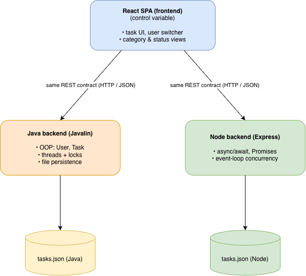

# MSCS 632 – Collaborative To-Do

A multi-user to-do / ticket app built **twice** — once with a **Java (Javalin)** backend and once with a **JavaScript (Node + Express)** backend — behind a single shared **React** frontend. Both backends implement the **same REST API**, so the one frontend can point at either and behave identically. The project's purpose is to compare how each language solves the same problem, especially **concurrency**.

> Team: An Phan, Vatsalkumar Mukeshkumar Dholakiya

---

## Overview



**Features**

- Multiple users; a "Working as" switcher (add new teammates from the dropdown).
- Tickets with **title, description, tag, status, assignee**, and **comments**.
- Five statuses: `Open`, `In Progress`, `Completed`, `Deprecated`, `Need Requirement`.
- Shared team board with filters by status, tag, and assignee.
- Create tickets in a modal; edit tickets (click a row to expand).
- A header badge shows **which backend is currently serving** (Node vs. Java).
- Each backend persists to its own `tasks.json` file.

---

## Install requirements

Install **Node.js 18+** and a **JDK 17+** (Gradle is not needed — a `./gradlew` wrapper is included).

**macOS** (with [Homebrew](https://brew.sh)):

```bash
brew install node openjdk
```

**Windows** (with winget, in PowerShell):

```powershell
winget install OpenJS.NodeJS.LTS
winget install EclipseAdoptium.Temurin.21.JDK
```

Then install all project dependencies in one step from the project root:

```bash
./setup.sh
```

This installs the frontend and Node-backend npm packages and builds the Java backend. (On Windows, run it from Git Bash, or follow the manual commands in the next section using `gradlew.bat` instead of `./gradlew`.)

### Troubleshooting: "Gradle requires JVM 17 or later, your JVM is 11/8"

This means your default Java is too old. Install a JDK 17+ (see the commands above) and point Gradle at it:

**macOS:**
```bash
brew install openjdk@21
export JAVA_HOME=$(/usr/libexec/java_home -v 21)   # applies to the current terminal
cd backend-java && ./gradlew run
```

**Windows (PowerShell):**
```powershell
winget install EclipseAdoptium.Temurin.21.JDK
# open a NEW terminal so PATH/JAVA_HOME update, then:
java -version                 # should say 21
cd backend-java; .\gradlew.bat run
```

**Already have a JDK 17+ installed?** Skip the install and point Gradle at it permanently for this project (no `JAVA_HOME` changes needed):
```bash
cp backend-java/gradle.properties.example backend-java/gradle.properties
# edit it and set: org.gradle.java.home=/full/path/to/jdk-17-or-newer
```
(Find installed JDK paths with `/usr/libexec/java_home -V` on macOS.)

---

## How to build / run locally

Run **one backend** plus the **frontend**. You must choose the backend. See next step for details

### 0. Choosing which backend the frontend talks to

Edit **`frontend/.env`**:

```
# Node backend
VITE_API_URL=http://localhost:4000

# Java backend
# VITE_API_URL=http://localhost:4001
```

Change the value and **restart `npm run dev`** (Vite reads env vars only at startup). The header badge confirms which backend answered.

### 1. Node backend — port 4000

```bash
cd backend-node
npm install        # if you didn't run ./setup.sh
npm start          # → "Node backend on http://localhost:4000"
```

### 2. Java backend — port 4001

```bash
cd backend-java
./gradlew run      # → "Java backend on http://localhost:4001"
```

### 3. Frontend — port 5173

```bash
cd frontend
npm install        # if you didn't run ./setup.sh
npm run dev        # → http://localhost:5173
```


---

## Code functionality: Java vs. JavaScript

Both backends expose the **same endpoints** and the same JSON shapes, so the frontend can't tell them apart by its API calls:

| Method | Route | Purpose |
|---|---|---|
| GET | `/meta` | which backend this is (for the header badge) |
| GET | `/users` · POST `/users` | list users · add a teammate |
| GET | `/tasks` (filter by `assignee`/`status`/`category`) | list tickets (incl. comments) |
| POST | `/tasks` · PUT `/tasks/:id` · DELETE `/tasks/:id` | create · edit · delete |
| PATCH | `/tasks/:id/status` | change status |
| POST | `/tasks/:id/comments` | add a comment |

What differs is **how each language implements it** — the point of the comparison:

### Java backend (`backend-java/`) — OOP + threads

- **Object-oriented:** real classes — `Task`, `User`, `Comment` (models), `TaskRepository` (storage), `TaskService` (business rules), `Main` (Javalin routes).
- **Concurrency via threads + a lock:** Javalin serves each request on its own thread (true parallelism). The shared task store is a map guarded by a `ReentrantReadWriteLock` — many reads can run together, but a write takes the lock exclusively and persists to disk *inside* the lock, so a read-modify-write-save cycle is atomic and two simultaneous edits can't corrupt the file.
- **Data:** typed Java objects serialized to `tasks.json` with the **Jackson** library.
- **Build/run:** Gradle (`./gradlew run`), JDK 17+.

### JavaScript backend (`backend-node/`) — async + event loop

- **Module/function style:** small modules — `store.js` (in-memory state + persistence), `service.js` (business rules), `app.js` (Express routes), `server.js` (entry) — composed with factory functions.
- **Concurrency via the event loop:** Node runs on a **single thread**. Each in-memory mutation is atomic because nothing else runs until the function `await`s. Disk writes are funneled through a **serialized promise queue** so overlapping saves can't clobber `tasks.json` — achieving the same safety as Java's lock, but without threads.
- **Data:** native **JSON** read/written with `fs.promises`.
- **Build/run:** npm (`npm start`), Node 18+.

### The concurrency contrast in one line

> Java keeps the shared data safe with **threads + a read/write lock**; Node keeps it safe with a **single-threaded event loop + an async write queue**. Same problem, opposite strategies — each dictated by the language's model.

> Note: field edits are **last-write-wins** (the lock/queue prevents *corruption*, not a *lost update*); **comments are append-only**, so concurrent comments never overwrite each other.
